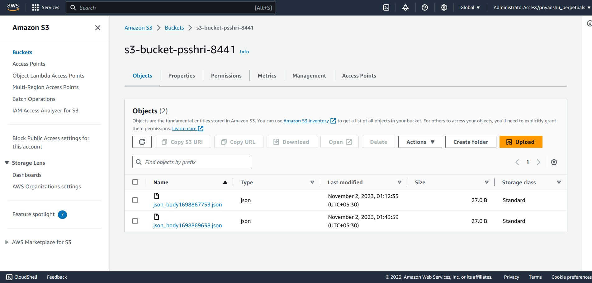
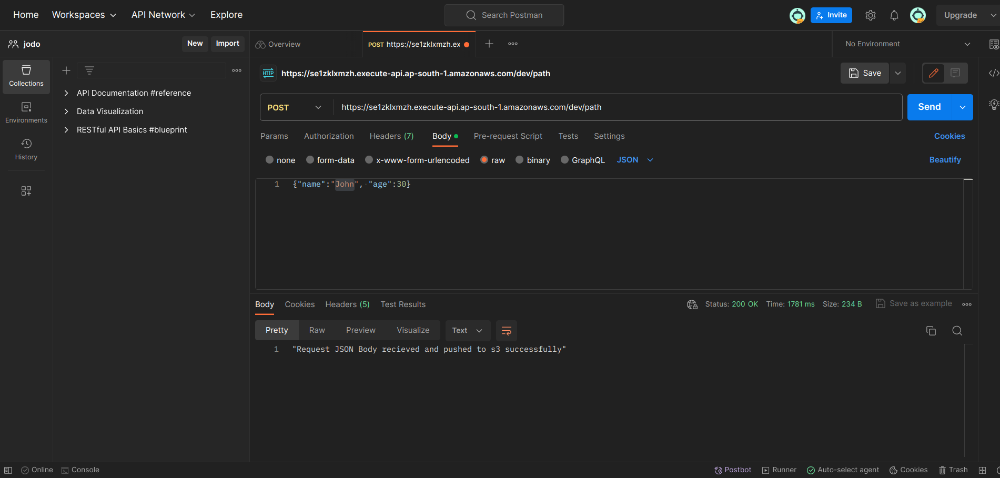
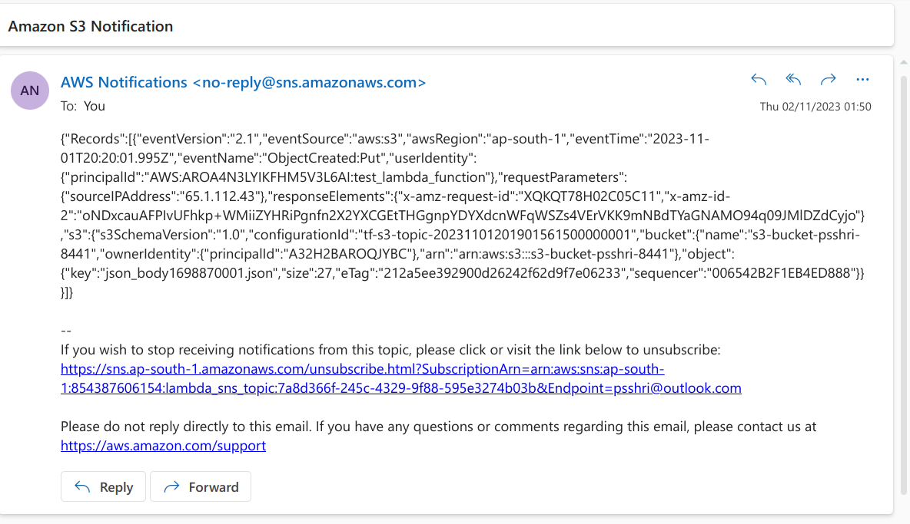
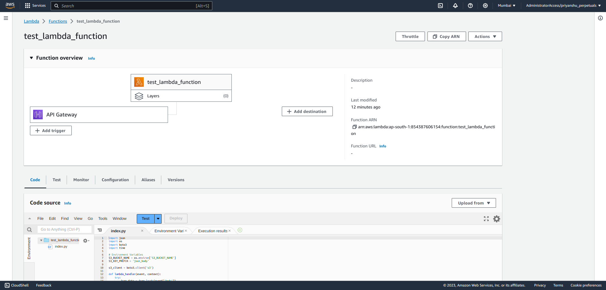
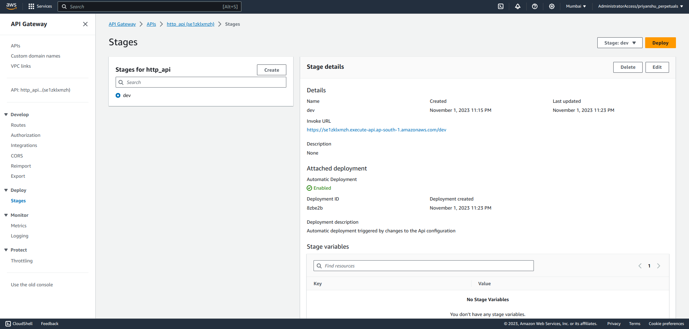
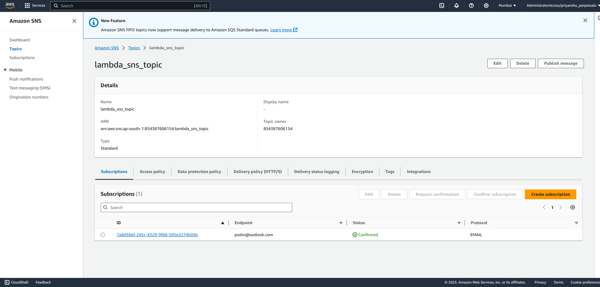

### Problem Statement:

Please represent the infra/services required to achieve the below use case in Code (Terraform)

Expose a 'POST' API endpoint using AWS API Gateway
API request should be handled by AWS Lambda, Lambda should simply store the request's JSON body to an S3 bucket as a file
Whenever a new file is created in the above S3 bucket - a notification should be pushed to an SNS topic with the file details

#### Screenshots from AWS portal

#### S3

#### Postman

#### Email

#### Lambda

#### API GW

#### SNS
